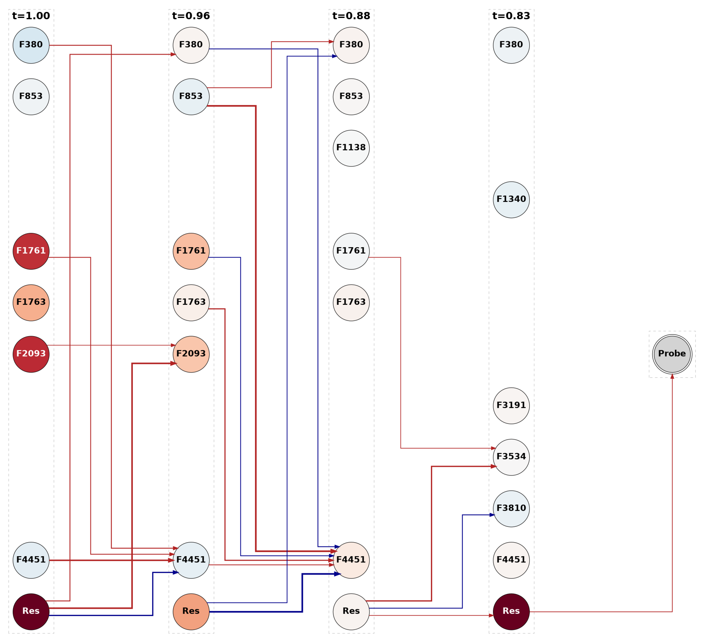
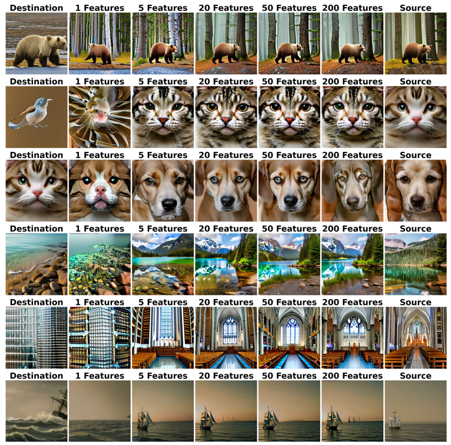

# Mechanistic Interpretability in Text-to-Image Diffusion Models

[](https://pytorch.org/) [](https://github.com/huggingface/diffusers) [](https://www.python.org/) [](https://github.com/astral-sh/ruff) [](https://opensource.org/licenses/MIT)

A framework for understanding the internal mechanisms of text-to-image diffusion models through Sparse Autoencoders (SAEs) and automated circuit discovery. This work enables researchers to identify and analyze the specific model components responsible for generating particular visual concepts, providing interpretable insights into how diffusion models transform text into images over time.

<table>
<tr>
<td width="50%" align="center">
<b>Circuit Discovery</b><br>
<br>
<i>Discovered circuit distinguishing bird/cat generation</i>
</td>
<td width="50%" align="center">
<b>Activation Patching</b><br>
<br>
<i>Effects of patching SD v2.1 down.2.0 SAE features</i>
</td>
</tr>
</table>

## Installation

```bash
# Install uv package manager
curl -LsSf https://astral.sh/uv/install.sh | sh

# Clone and install
git clone https://github.com/jhschlegel/mechinterp-diffusion.git
cd mechinterp-diffusion
uv pip install -e .
```

## Usage Workflow
